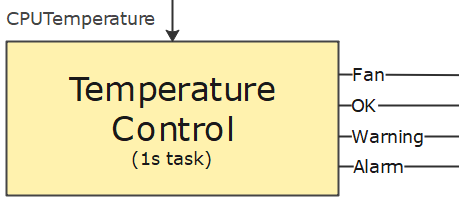

# Calculators

Calculators have no direct connection to the hardware, but communicate exclusively with the signal hub.

The calculators are called up in special calculator tasks. A calculator task first calls the calculator assigned to it in  `read` mode. This gives the calculator the opportunity to read signals from the signal hub. Once the signals have been read, the calculator is called up in `calculate` mode. In the last step, the calculator is called up in `write` mode and can now write the calculated values back to the signal hub.

## Temperature monitoring
In this part of the tutorial, we will add the temperature monitoring to our application in the form of a calculator.



The temperature monitoring requires the current CPU temperature as an input signal. Depending on the temperature, we set the status to `OK`, `Warning` or `Alarm`. If the system is in `Warning` or `Alarm` status, the fan should also be switched on. 

Create a new class `TemperatureMonitoring`.

```{literalinclude} assets/code/TemperatureMonitoring.cs
---
language: csharp
lines: 1-9,19-22,88-
---
```


## Configuration


## Connections

